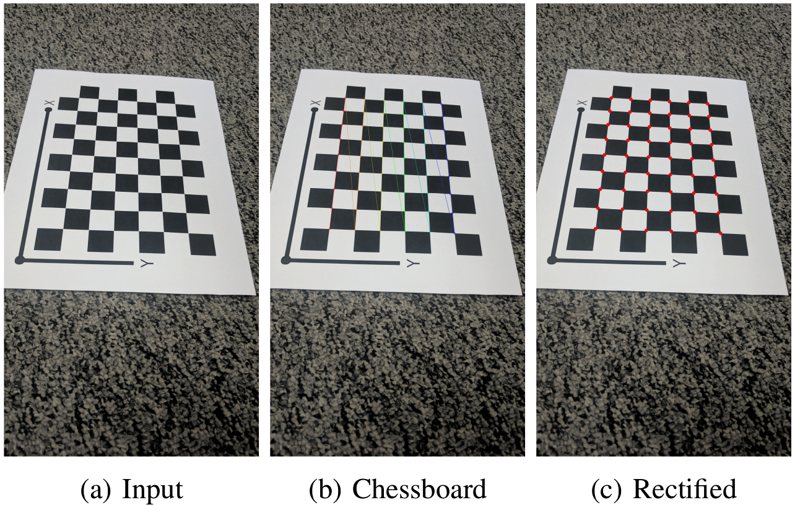

# CameraCalib-AutoCalib:

## Table of Contents

- [Overview](#overview)
- [Requirements](#requirements)
- [Usage](#usage)
- [Functions](#functions)
- [Acknowledgments](#acknowledgments)

## Overview

| **Results Overview** |  
|----------|
|  |
| Input, Chessboard, Rectified of an Image |

This project provides an implementation of camera calibration using a checkerboard pattern. The calibration technique is based on Zhengyou Zhang's method, which involves estimating the intrinsic and extrinsic parameters of the camera. The implementation includes:

- Estimation of the homography matrix for each calibration image
- Calculation of the intrinsic camera matrix
- Determination of the rotation and translation vectors for each image
- Optimization of the intrinsic and distortion parameters
- Error calculation before and after optimization

## Requirements

To run this script, you need Python 3 and the following Python packages:
- `Numpy`
- `Opencv-python`
- `Scipy`


You can install these packages using pip:

```bash
pip install numpy opencv-python scipy
```

## Usage

* Clone the repository:
```bash
git clone https://github.com/AbhijeetRathi12/CameraCalib-AutoCalib.git
cd CameraCalib-AutoCalib-main
```

* Place your calibration images in the `Calibration_Imgs` folder. Ensure the images contain a visible checkerboard pattern with 9x6 inner corners.

* Run the main script:
```bash
python Wrapper.py
```

* The results will be saved in the `Results` folder:
    - `Checkerboard/` folder will contain images with detected checkerboard corners.
    - `Final/` folder will contain undistorted images with reprojected points after optimization.


## Functions

- **Homography_function(M_pt, corners)**: Computes the homography matrix given the world points and image corners.
- **checkerboard_homography(images, M_pt, Output_folder_checkerboard)**: Detects checkerboard corners in the images and computes homography matrices.
- **Intrinsic_Matrix(Homography)**: Calculates the intrinsic camera matrix from homographies.
- **Rotation_Matrix(Intrinsic_A, Homography)**: Computes rotation matrices from the intrinsic matrix and homographies.
- **loss(Intrinsic_A, Corners, M_pt, Rotation_R)**: Computes the reprojection error given intrinsic parameters, image corners, world points, and rotation matrices.
- **Optimize(Intrinsic_A, Corners, M_pt, Rotation_R)**: Optimizes intrinsic parameters and distortion coefficients to minimize reprojection error.
- **error(A_optimized, Distortion, Rotation_R_optimized, Corners, M_pt)**: Calculates the reprojection error after optimization.


## Acknowledgements

- This project is based on the camera calibration method proposed by Zhengyou Zhang.


